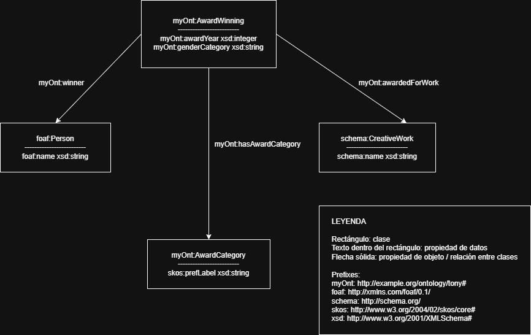

# SHACL validation - Tony Awards

## Improved conceptual model

The original conceptual model has been improved by introducing the class `myOnt:AwardWinning`.

This class represents each concrete award winning record in the dataset. Each record links:

- the winning person,
- the awarded work,
- the award category,
- the award year,
- and the gender category.

This model is more accurate because the dataset rows represent award-winning events, not only persons or works.

## Implemented SHACL shapes and restrictions

The SHACL file contains several shapes checking different kinds of constraints: cardinality, datatype, class, pattern, value range and controlled values.

1. Every `foaf:Person` must have exactly one non-empty `foaf:name`.
2. Every `schema:CreativeWork` must have exactly one non-empty `schema:name`.
3. Every `myOnt:AwardCategory` must have exactly one `skos:prefLabel`.
4. The award category label must contain either `Play` or `Musical`.
5. Every `myOnt:AwardWinning` must have exactly one winner.
6. Every `myOnt:AwardWinning` must be linked to exactly one work.
7. Every `myOnt:AwardWinning` must have exactly one award category.
8. Every `myOnt:AwardWinning` must have exactly one award year.
9. The award year must be an integer between 1982 and 2015.
10. The gender category must be either `masculina` or `femenina`.

## Validation result

The validation report does not conform because the data file intentionally includes incorrect examples.

Detected problems include:

- A person without name.
- A work without name.
- An award category without label.
- An award winning record without winner.
- An award winning record without work.
- A year outside the valid range.
- An invalid gender category.

## Corrections needed

To correct the data:

- Add missing names to persons and works.
- Add labels to award categories.
- Add missing winners and works to award winning records.
- Replace invalid gender values with `masculina` or `femenina`.
- Use only years between 1982 and 2015.
